# SUBIT‑64 Data Flow  
### Canonical Semantic Pipeline

This document defines the complete data‑flow pipeline of the SUBIT‑64 Semantic Layer.  
It describes how raw user input is transformed into a structured, interpretable, and behaviorally consistent agent output through the SUBIT‑64 ontology, shadow modulation, MIST‑Engine reasoning, and semantic topology mapping.

---

## 1. Overview

SUBIT‑64 processes information through a deterministic semantic pipeline:

```
Input → SENSE‑10 → SUBIT‑6 → 6‑bit Codon → SUBIT‑64 State → Shadow Modulation → MIST‑Engine → Semantic Topology → Behavioral Mask → Output
```

Each stage contributes a specific transformation, ensuring stability, interpretability, and semantic coherence.

---

## 2. Pipeline Stages

### **2.1 User Input**
Raw natural‑language input from the user.  
No assumptions, no preprocessing beyond tokenization.

---

### **2.2 SENSE‑10 Vectorization**
The input is encoded into a **10‑dimensional subjective vector** representing:

- intent  
- emotional tone  
- urgency  
- complexity  
- ambiguity  
- relational stance  
- temporal orientation  
- risk level  
- domain specificity  
- cognitive mode  

This is the **subjective signature** of the input.

---

### **2.3 SUBIT‑6 Axis Reduction**
SENSE‑10 is reduced to **six binary semantic axes**:

1. Order / Chaos  
2. Self / Other  
3. Abstract / Concrete  
4. Active / Passive  
5. Inner / Outer  
6. Flow / Structure  

This produces a **6‑bit semantic codon**.

---

### **2.4 6‑bit Codon → SUBIT‑64 State**
The codon maps to one of **64 archetypal states**, each defining:

- cognitive stance  
- behavioral mode  
- semantic attractor  
- narrative function  

This is the **core semantic identity** of the input.

---

### **2.5 Shadow Modulation**
The selected archetype is modulated by **shadow axes**, introducing:

- depth  
- asymmetry  
- emotional tension  
- dynamic resonance  

This prevents rigid or overly deterministic behavior.

---

### **2.6 MIST‑Engine Reasoning**
The **Modular Interpretive Structured Thinking** engine performs:

- structured reasoning steps  
- stabilization of cognitive flow  
- alignment with the active archetype  
- prevention of drift and hallucination  
- modular interpretive cycles  

MIST is the **cognitive stabilizer** of SUBIT‑64.

---

### **2.7 Semantic Topology Mapping**
The reasoning output is mapped onto a **semantic manifold**:

- nodes (concepts)  
- edges (relations)  
- gradients (semantic direction)  
- basins (attractors)  
- transitions (semantic motion)  

This ensures **coherent semantic navigation**.

---

### **2.8 Behavioral Mask Application**
A persona or role mask modulates:

- tone  
- constraints  
- commitments  
- behavioral style  

Masks do not alter the ontology — they shape the **expression**.

---

### **2.9 Final Output**
The agent produces a response that is:

- semantically grounded  
- archetype‑aligned  
- topologically coherent  
- behaviorally consistent  
- interpretable  

This is the **canonical SUBIT‑64 output**.

---

## 3. Mermaid Diagram (Markdown‑Native)

```mermaid
flowchart LR
    A[User Input] --> B[SENSE‑10<br><sub>Subjective Vector</sub>]
    B --> C[SUBIT‑6<br><sub>Binary Axes</sub>]
    C --> D[6‑bit Codon<br><sub>Semantic Encoding</sub>]
    D --> E[SUBIT‑64 State<br><sub>Archetypal Mapping</sub>]
    E --> F[Shadow Modulation<br><sub>Depth & Asymmetry</sub>]
    F --> G[MIST‑Engine<br><sub>Structured Reasoning</sub>]
    G --> H[Semantic Topology<br><sub>Manifold Navigation</sub>]
    H --> I[Behavioral Mask<br><sub>Persona / Role</sub>]
    I --> J[Agent Output]

    classDef node fill:#f2f2f2,stroke:#333,stroke-width:1px,color:#000
    class A,B,C,D,E,F,G,H,I,J node
```



---

## 4. Canonical Summary

SUBIT‑64 transforms raw input into structured meaning through:

- subjective encoding  
- semantic reduction  
- archetypal mapping  
- shadow modulation  
- structured reasoning  
- topological navigation  
- behavioral modulation  

The result is a **stable, interpretable, and semantically coherent agent output**.

