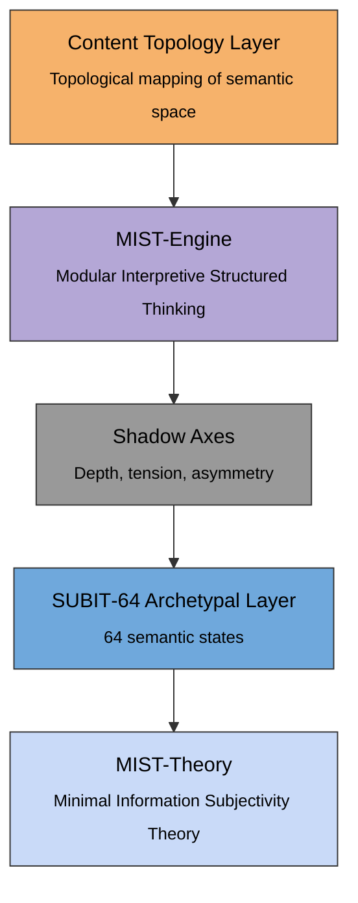

```mermaid
flowchart TB
    A[Content Topology Layer<br><sub>Topological mapping of semantic space</sub>]:::top
    B[MIST-Engine<br><sub>Modular Interpretive Structured Thinking</sub>]:::mist
    C[Shadow Axes<br><sub>Depth, tension, asymmetry</sub>]:::shadow
    D[SUBIT‑64 Archetypal Layer<br><sub>64 semantic states</sub>]:::archetypes
    E[MIST-Theory<br><sub>Minimal Information Subjectivity Theory</sub>]:::theory

    A --> B --> C --> D --> E

    classDef top fill:#f6b26b,stroke:#333,stroke-width:1px,color:#000
    classDef mist fill:#b4a7d6,stroke:#333,stroke-width:1px,color:#000
    classDef shadow fill:#999999,stroke:#333,stroke-width:1px,color:#000
    classDef archetypes fill:#6fa8dc,stroke:#333,stroke-width:1px,color:#000
    classDef theory fill:#c9daf8,stroke:#333,stroke-width:1px,color:#000
```
